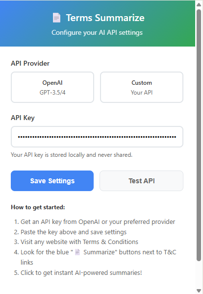
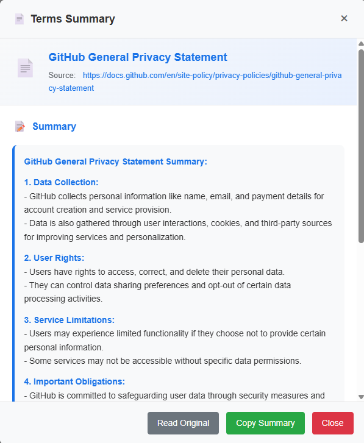

# TL;DR Conditions

[](https://chrome.google.com/webstore)
[](https://opensource.org/licenses/MIT)
[](https://openai.com)
[](https://www.typescriptlang.org)
[](http://makeapullrequest.com)

> **"Because who really reads them?"** — Your friendly neighborhood AI lawyer

Let's be honest: you've never read a Terms & Conditions document in your life. You just scroll to the bottom, click "I Agree," and hope for the best. Well, congratulations! You've probably signed away your firstborn child to at least 47 different companies by now.

**TL;DR Conditions** is here to save your lazy soul from accidentally agreeing to sell your data to sketchy third parties or promising your eternal servitude to a tech conglomerate. We use AI to actually read those 47-page legal documents so you don't have to, then give you the cliff notes in plain English.

*Because let's face it — you're not going to read them anyway, but at least now you'll know what you're not reading.*

## ✨ Features

- **🔍 Smart Detection** - Finds those sneaky legal links so you don't have to hunt for them
- **🤖 AI-Powered Summaries** - Your personal AI lawyer that actually reads the fine print
- **⚡ Lightning Fast** - Because your attention span is shorter than a TikTok video
- **🔒 Privacy First** - We don't spy on you (unlike those apps you agreed to)
- **📋 Easy Sharing** - Copy the summary to warn your friends about what they're signing
- **🎨 Beautiful UI** - Pretty enough to make you forget you're dealing with legal stuff

## 🚀 Quick Start

### Installation (Takes 2 minutes, we promise)

1. **Download** the extension files (or clone this repo if you're fancy)
2. **Open Chrome** and go to `chrome://extensions/` (yes, copy-paste that)
3. **Enable Developer Mode** (the toggle in the top-right, not rocket science)
4. **Click "Load unpacked"** and select the extension folder
5. **Pin the extension** to your toolbar (so you don't forget it exists)

### Configuration (The boring but necessary part)

1. **Click the TL;DR Conditions icon** in your Chrome toolbar
2. **Get an OpenAI API key** from [platform.openai.com](https://platform.openai.com/api-keys) (it's free to start)
3. **Paste your API key** in the settings (don't worry, we store it locally)
4. **Save and test** the connection (if it fails, blame the internet)

### Usage (The fun part)

1. **Visit any website** with Terms & Conditions or Privacy Policy (so... basically every website)
2. **Look for blue "📄 Summarize" buttons** next to legal document links
3. **Click to get instant summaries** of what you're about to agree to
4. **Read, copy, or share** the summaries (and finally understand what you're signing)

## 📸 Screenshots

<div align="center">
  <h3>🔍 Extension in Action</h3>
  
  <p><em>TL;DR Conditions automatically finds and highlights legal document links</em></p>
  
  <br>
  
  <h3>📄 AI-Powered Summary</h3>
  
  <p><em>Get instant, easy-to-understand summaries of what you're actually agreeing to</em></p>
</div>

### 🎬 Quick Demo

Want to see it in action? Here's what happens when you click that blue "📄 Summarize" button:

1. **Detection**: The extension scans the page for legal document links
2. **AI Processing**: Sends the document to OpenAI for analysis
3. **Summary Generation**: Creates a structured, easy-to-read summary
4. **Display**: Shows you exactly what you're agreeing to in plain English

*No more scrolling through 47 pages of legal jargon just to find out you're selling your soul to a tech company!*

## 🏗️ Architecture

### Core Components

- **Content Script** - Detects legal document links and injects UI
- **Background Service Worker** - Handles API communication and data storage
- **Popup Interface** - Settings and configuration management
- **AI Integration** - OpenAI GPT for intelligent summarization

### Performance Optimizations

- **Selective Scanning** - Only processes pages likely to contain legal documents
- **Debounced Updates** - Prevents excessive re-scanning on dynamic content
- **Limited Button Count** - Maximum 5 buttons per page to prevent UI clutter
- **GPU Acceleration** - CSS optimizations for smooth rendering

## 🛠️ Development

### Prerequisites

- Node.js 16+ (for development tools)
- Chrome browser with Developer Mode enabled
- OpenAI API key (for AI functionality)

### Project Structure

```
tldr-conditions/
├── code/                    # Extension source code
│   ├── manifest.json       # Extension configuration
│   ├── content.js          # Content script (optimized)
│   ├── content.css         # Styling and UI components
│   ├── background.js       # Service worker for API calls
│   ├── popup.html          # Settings page interface
│   ├── popup.js            # Settings page logic
│   ├── test-page.html      # Development test page
│   └── icons/              # Extension icons
├── docs/                   # Documentation
│   ├── README.md           # This file
│   ├── INSTALLATION.md     # Detailed setup guide
│   ├── PROJECT_STRUCTURE.md # Technical documentation
│   └── ...                 # Additional docs
└── tests/                  # Test files (future)
```

### Building from Source

1. **Clone the repository**
   ```bash
   git clone https://github.com/sacredvoid/tldr-conditions.git
   cd tldr-conditions
   ```

2. **Load in Chrome**
   - Open `chrome://extensions/`
   - Enable Developer Mode
   - Click "Load unpacked" and select the `code/` directory

3. **Configure API**
   - Click the extension icon
   - Enter your OpenAI API key
   - Test the connection

### Contributing

We welcome contributions! Please see our [Contributing Guidelines](CONTRIBUTING.md) for details.

1. **Fork the repository**
2. **Create a feature branch** (`git checkout -b feature/amazing-feature`)
3. **Commit your changes** (`git commit -m 'Add amazing feature'`)
4. **Push to the branch** (`git push origin feature/amazing-feature`)
5. **Open a Pull Request**

## 🔧 Configuration

### API Providers

LegalLens supports multiple AI providers:

- **OpenAI** (Recommended) - GPT-3.5-turbo, GPT-4
- **Custom API** - Your own backend service

### Settings

- **API Key** - Your OpenAI or custom API key
- **API URL** - Custom endpoint (optional)
- **Rate Limiting** - Built-in protection against API limits

## 📊 Performance

### Benchmarks

- **Scan Time** - < 50ms average (monitored)
- **Memory Usage** - < 2MB additional overhead
- **Page Impact** - Non-blocking, runs after page load
- **Button Limit** - Maximum 5 per page

### Monitoring

Built-in performance monitoring tracks:
- Scan duration and efficiency
- Number of links found and buttons created
- API response times and error rates

## 🔒 Privacy & Security

- **Local Storage** - API keys stored securely in Chrome storage
- **Minimal Data** - Only processes URLs and link text
- **No Tracking** - No analytics or user behavior tracking
- **HTTPS Only** - All API communication over secure connections
- **Open Source** - Full source code available for review

## 🐛 Troubleshooting

### Common Issues

**Extension not loading**
- Ensure Developer Mode is enabled
- Check that all files are in the correct directory
- Try reloading the extension

**No summarize buttons appearing**
- Refresh the webpage
- Verify the page contains legal document links
- Check browser console for errors

**API errors**
- Verify your API key is correct and has credits
- Check rate limits (429 error means too many requests)
- Ensure stable internet connection

**Performance issues**
- Check browser console for performance warnings
- Try disabling other extensions temporarily
- Clear browser cache and reload

## 📈 Roadmap

### Version 1.1
- [ ] Support for more document types
- [ ] Batch summarization
- [ ] Export summaries to PDF
- [ ] Dark mode theme

### Version 1.2
- [ ] Multi-language support
- [ ] Advanced filtering options
- [ ] Summary history
- [ ] Custom prompt templates

### Version 2.0
- [ ] Backend service integration
- [ ] Caching and offline support
- [ ] Team collaboration features
- [ ] Advanced analytics

## 🤝 Support

- **Documentation** - Check our [docs](docs/) folder
- **Issues** - Report bugs on [GitHub Issues](https://github.com/sacredvoid/tldr-conditions/issues)
- **Discussions** - Join our [GitHub Discussions](https://github.com/sacredvoid/tldr-conditions/discussions)
- **Email** - Contact us at support@tldrconditions.app

## 📄 License

This project is licensed under the MIT License - see the [LICENSE](LICENSE) file for details.

---

<div align="center">
  <strong>Made with ❤️ for lazy people who still want to be safe</strong>
  <br>
  <a href="https://github.com/sacredvoid/tldr-conditions">⭐ Star us on GitHub</a>
  <span> • </span>
  <a href="https://github.com/sacredvoid/tldr-conditions/issues">🐛 Report Issues</a>
</div>